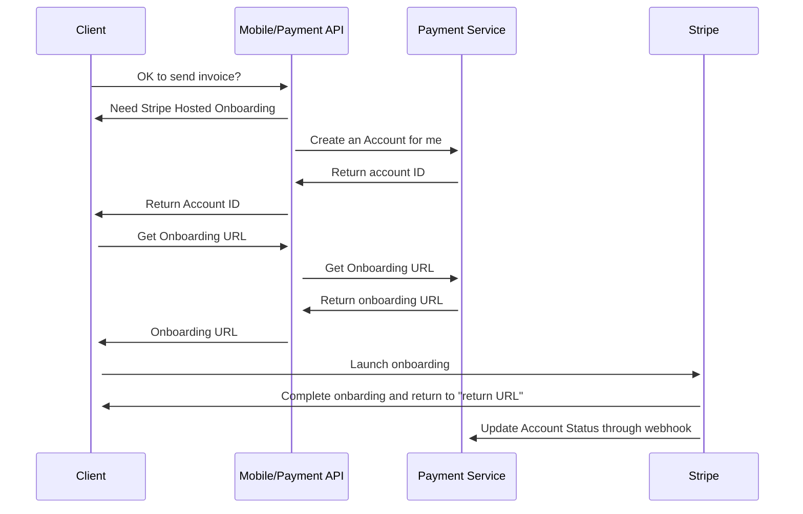

# Mermaid Demo

```mermaid
sequenceDiagram
    participant C as Client
    participant t3 as Mobile/Payment API
    participant svc as Payment Service
    participant S as Stripe
    C->>+t3: OK to send invoice?
    t3->>+C: Need Stripe Hosted Onboarding
    t3->>+svc: Create an Account for me
    svc->>+t3: Return account ID
    t3->>+C: Return Account ID
    C->>+t3: Get Onboarding URL
    t3->>+svc: Get Onboarding URL
    svc->>+t3: Return onboarding URL
    t3->>+C: Onboarding URL
    C->>+S: Launch onboarding
    S->>+C: Complete onbarding and return to "return URL"
    S->>+svc: Update Account Status through webhook
```
